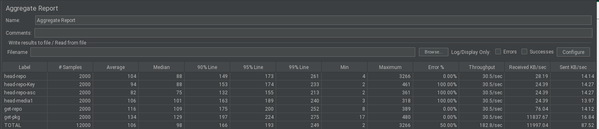
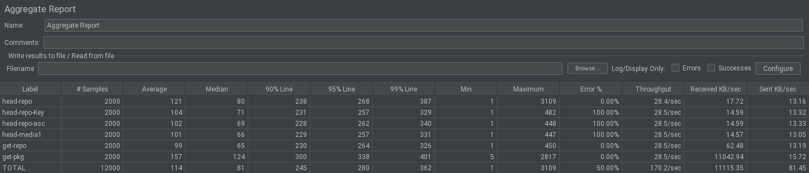
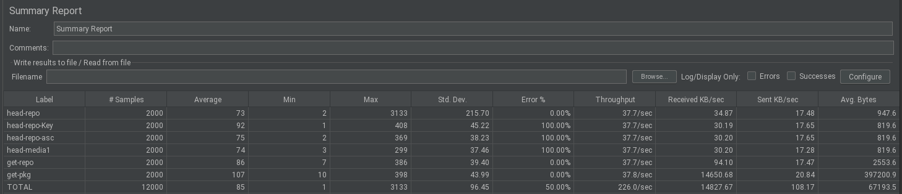
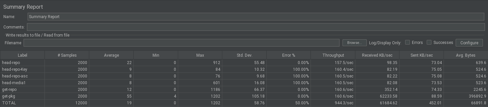

NOTE: hackweek level code.

# Suma Downloade

Extract the /rhn/download endpoint to an external service.
This endpoint is stateless. 

It extracts autentication from header (if authentication is enabled) and checks the JWT token.
After this, connects to database to retrive the path in the file system for the package to be downloaded.


# Run
`go build`
Copy the artifact to sumas server
Run it `./go-suma`

port 8088 will expose the API

## Chance apache httd config

TODO

## repository

One can use the same suma repository endpoints but with port `8088` instead.
example: 
`http://localhost:8088/rhn/manager/download/sle-module-basesystem15-sp3-updates-x86_64`

# TODO
- [ ] Download for media files
- [ ] Add a flag to say if go should reply directly or through apache header
- [ ] Parameterize the folder location
- [ ] Automatic tests
- [ ] check if we can improve the authentication token check, which is what is taking performance
- [ ] Apache is doing some contenction in reply. Check if using the apache header to server files is faster

# Install

## 1. Install executable

copy file "go-suma" from the repo to the suse manager server host at "/usr/bin/go-suma"

## 2. intall service

create the service file at "/usr/lib/systemd/system/go-suma.service"

```
[Unit]
Description=The SUMA Download API
After=syslog.target network.target

[Service]
Type=simple
Restart=always
User=nobody
StandardOutput=syslog
StandardError=syslog
SyslogIdentifier=go-suma
ExecStart=/usr/bin/go-suma
User=tomcat
Group=tomcat


[Install]
WantedBy=multi-user.target

```

after this run:
- `systemctl daemon-reload`
- `systemctl start go-suma.service`

Check the logs with: `journalctl -u go-suma -f`


## 3. apache configuration


Add the following line to the apache file located at "/etc/apache2/conf.d/zz-spacewalk-www.conf"
(this file should be placed just before the line `RewriteRule ^/rhn(.*) ajp://localhost:8009/rhn$1 [P]` which in suma 4.3 is located at line 74)

Line to add:

```
RewriteRule ^/rhn/manager/download(.*) http://localhost:8088/rhn/manager/download$1 [P]
```

after this restart apache with: `rcapache2 restart`


# Benchmark

Requests sequence (scenario):

- Head request for repomd.xml: 200
- Head request for repo key: 404
- Head request for repo asc: 404
- Head request for repo media: 404
- GET request for repomd.xml: 200
- GET request for one package: 200

Calls:
- 20 threads
- 100 Loops

Running with jmeter


## Throughput with channel authentication ON

### Existing code



### go-suma configured with apache rewrite rule



## Throughput with channel authentication OFF

### Existing code



### go-suma configured with apache rewrite rule

